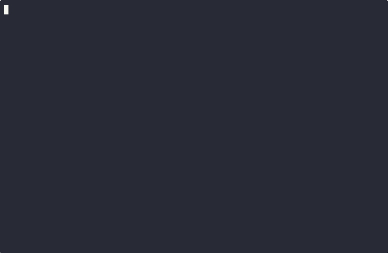

fencechecker
============

A CLI app that will execute any fenced code blocks of Python in Markdown files
to ensure they don't raise any errors.



Usage
-----

```sh-session
❯ fencechecker --help

 Usage: fencechecker [OPTIONS] FILEPATHS...

╭─ Arguments ──────────────────────────────────────────────────────────────────╮
│ *    filepaths      FILEPATHS...  The Markdown files to process. [required]  │
╰──────────────────────────────────────────────────────────────────────────────╯
╭─ Options ────────────────────────────────────────────────────────────────────╮
│ --only-report-errors  -e            Only include errors when reporting.      │
│ --python-binary       -p      TEXT  The Python binary to use to execute      │
│                                     code.                                    │
│                                     [default: python3]                       │
│ --help                              Show this message and exit.              │
╰──────────────────────────────────────────────────────────────────────────────╯
```

**NOTE**: The exit code of the app is the number of errors encountered. Thus, a
run without issue will exit with a code of `0`.

Example
-------

You can run `fencechecker` with this readme and yield the following results:

The below code example will pass with a status of OK.

```python
assert 1 == 1
```

The below code example will fail with an error status.

```python
assert 2 == 3
```

License
-------

The MIT License. See the [license file](LICENSE) for details.
